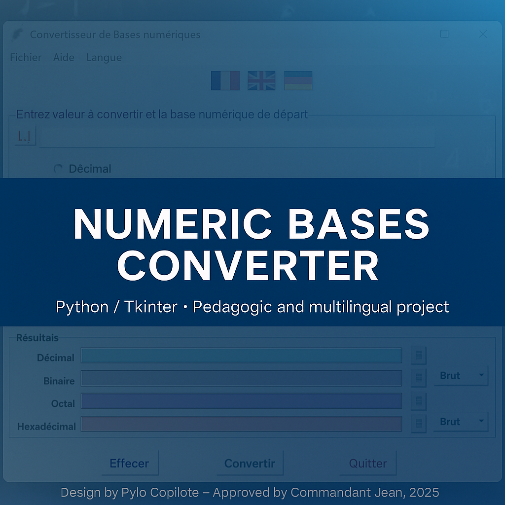
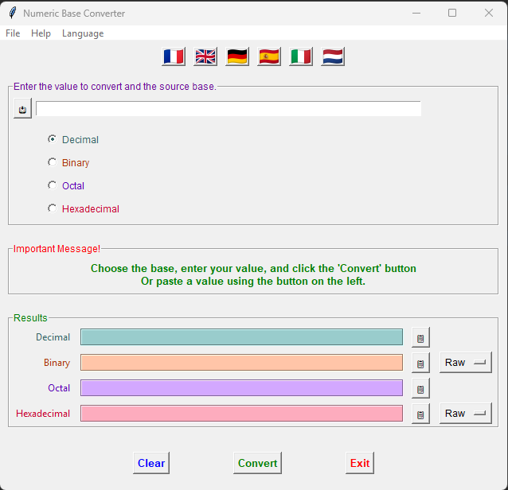
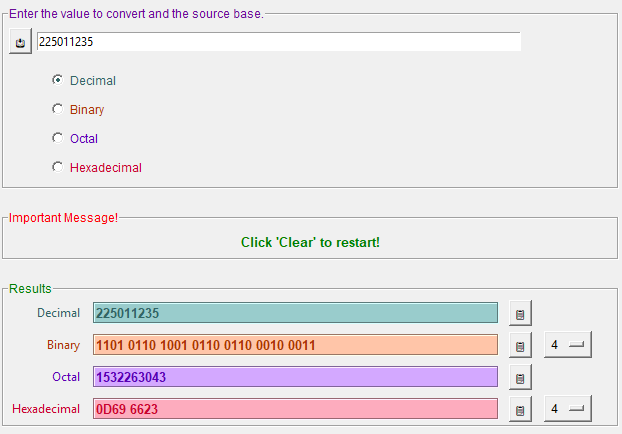
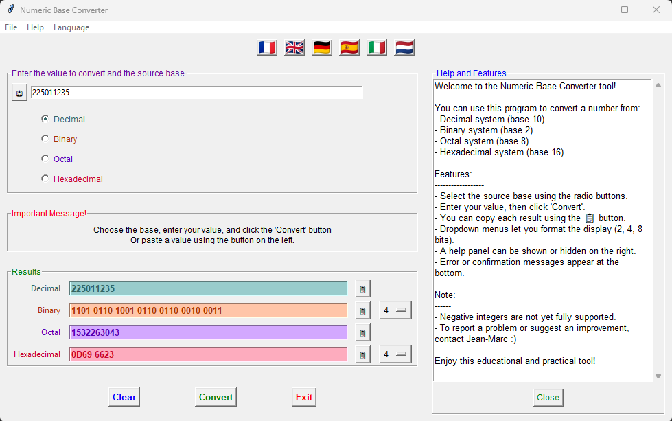

# 🧮 Numeric Bases Converter / Convertisseur de Bases Numériques — V4.3.1

> 🇫🇷
>
> Outil pédagogique en **Python / Tkinter** permettant de convertir des valeurs
> entre différentes bases numériques (**binaire**, **octale**, **décimale**, **hexadécimale**).  
> Interface claire, **multilingue** et évolutive.
>
> **Points forts :**
> - Interface graphique (GUI) réalisée avec **Tkinter**
> - Conversion instantannée des bases **2 • 8 • 10 • 16**
> - Options de résultats formatés (blocs de **2**, **4**, ou **8** caractères)
> - **Multilingue** (FR / EN / DE / ES / IT / NL)
> - Aide et contexte dans les différentes langues
> - Code documenté et pédagogiquement explicité.
> - Prêt pour une évolution et un usage de modules liés à la crytographie
>
> 📘 Plus d’informations : [README_FR.md](./README_FR.md)

---

> 🇬🇧
>
> Educational tool built in **Python / Tkinter** for converting numeric values
> between **binary**, **octal**, **decimal**, and **hexadecimal** systems.  
> Clear, **multilingual**, and extensible interface.
>
> **Highlights :**
> - Graphical interface made with **Tkinter**
> - Instant conversion between **2 • 8 • 10 • 16** bases
> - Output formatting options (blocks of **2**, **4**, or **8** characters)
> - **Multilingual support** (FR / EN / DE / ES / IT / NL)
> - Help and Context panels in multiple languages
> - Clean, well-commented, educational codebase
> - Future-ready for cryptography-related modules
>
> 📘 More information: [README_EN.md](./README_EN.md)

---

##  Quick Start / Démarrage rapide

### Run directly / Exécution directe
```bash
python conv_num_gui.py
```

### Optional – Build an executable / Optionnel - Réalisation d'un éxécutable
```bash
pyinstaller --onefile conv_num_gui.py
```

> Requires / Requis [PyInstaller](https://pyinstaller.org/en/stable/).  
> To install / Installation : `pip install pyinstaller`

---

## Screenshots / Vues d’écran

| Interface principale | Conversion & Résultats | Panneau d’aide | Panneau de contexte |
|    Main interface    |  Conversion & Résults  |   Help Pannel  |   Context Pannel    |
|----------------------|------------------------|----------------|---------------------|
|  |  |  |  |

---

##  Documentation

### 🇫🇷 Fiches mémo (français)
- [🧭 Fiche 1 – Raccourcis clavier et gestion des événements](./Documentation/Fiche_1_memo_Tkinter_raccourcis.md)  
- [🧭 Fiche 2 – Menus et événements souris](./Documentation/Fiche_2_memo_Tkinter_menus_souris.md)  
- [🧭 Fiche 3 – Widgets essentiels & Internationalisation (i18n)](./Documentation/Fiche_3_memo_Tkinter_widgets_i18n.md)
- [🧭 Fiche 4 – PyInstaller](./Documentation/Fiche_4_memo_PyInstaller.md)
- [🧭 Fiche 5 – Bouton actions Tkinter](./Documentation/Fiche_5_Mémo_bouton_actions_Tkinter_FR.md)
- [🧭 Fiche 6 – Rappels des mises à jour de /main par /dev dans GitHUb](./Documentation/Fiche_6_git_convertisseur.md)
- [🧭 Fiche 7 – Navigation et raccourcis clavier utiles dans VSCode](./Documentation/Fiche_7_Mémo_Navigation_VSCode_python.md)

### 🇬🇧 Memo Sheets (English)
- [🧭 Memo 1 – Tkinter Keyboard Shortcuts](./Documentation/Memo_1_EN_Tkinter_shortcuts.md)  
- [🧭 Memo 2 – Tkinter Menus & Mouse Events](./Documentation/Memo_2_Tkinter_menus_mouse.md)
- [🧭 Memo 3 – Tkinter Widgets & Internationalization (i18n)](./Documentation/Memo_3_Tkinter_widgets_i18n.md)
- [🧭 Memo 4 – PyInstaller](./Documentation/Memo_4_PyInstaller_EN.md)
- [🧭 Memo 5 – Tkinter Buttons actions](./Documentation/Memo_5_Tkinter_Button_Actions.md)
- [🧭 Memo 6 – GitHub /main update from /dev](./Documentation\Memo_6_EN_git_convertisseur.md)
- [🧭 Memo 7 – VSCode navigation and shortkeys](./Documentation\Memo_7_EN_Navigation_VSCode_python.md)

---

## Requirements (optionnels)

Ce projet fonctionne uniquement avec les bibliothèques standard de Python.  
Les thèmes suivants sont **optionnels** :

```
sv-ttk>=2.6
ttkbootstrap>=1.10
```

Installer via :
```bash
pip install -r requirements.txt
```

---

## Contribuer / Contributing

Les contributions sont les bienvenues !  
Merci de consulter [CONTRIBUTING.md](./CONTRIBUTING.md) avant toute proposition.

---

## Versions

20/11/2025
/main V4.3.1 
/dev V4.3.2-dev  (en cours / work in progres)

---

## Licence

Projet sous **GPL-3.0**  
Usage **personnel et éducatif** autorisé.  
Reproduction et réutilisation possibles avec mention de l’auteur :  
**Jean-Marc (Jean) Alcaïno**.

---

## Remerciements

Développé par **Jean-Marc Alcaïno**  
Secondé par **Pylo** Merci à lui.  

---
